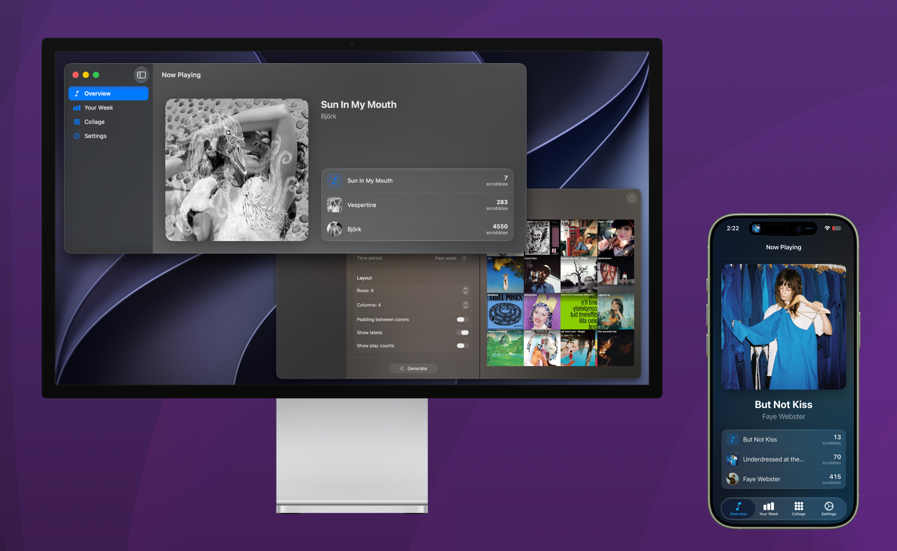

# Scrobblrr
A scrobbler for macOS and iOS, focused on Apple Music support. Automatically fixes your tags, integrates with iMessage, and much more for a better listening experience.

> [!WARNING]  
> This is a work in progress! The UI may change, crashes may occur, and hell may break loose. Use at your own risk.

## Downloads
- macOS: Download
- iOS: Join the TestFlight program (for now.)..

## TODO
- [ ] Clean up code
- [ ] Test support on devices w/ no Apple Intelligence
- [ ] Find an app icon
- [ ] Enhance SilentAudioKeeper for better life time on iOS
- [X] Musicorum API integration
- [ ] Actually push to App Store Connect
- [ ] Add some requests to cache using NSCache
- [ ] iMessage app for sending collages and now playing song info (getting there)
